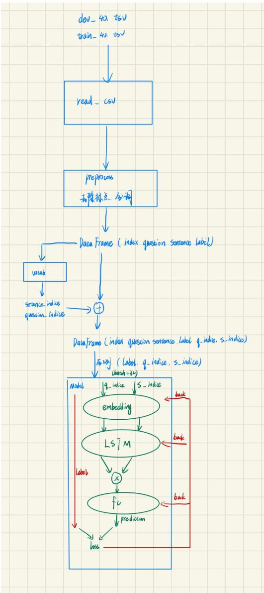

#
 Natural-Language-Inference

## 算法原理

自然语言推理（NLI）是一种自然语言处理（NLP）任务，旨在让机器理解句子之间的逻辑关系。NLI 算法的核心目标是确定两个给定的句子——通常是一对前提和假设——之间的语义关系。

本代码模型首先将输入的文本序列进行预处理，之后构建一个词汇表，通过遍历训练集和测试集，将所有单词加入到 set 中，并将词汇表转换为词索引对应的字典。接着利用字典把词向量转换为索引向量，再经过一系列处理后送入神经网络（关于神经网络具体细节在下面关键代码部分给出），使用交叉熵损失函数和 Adam 优化器进行优化。

## 代码运行
`python NLI.py`